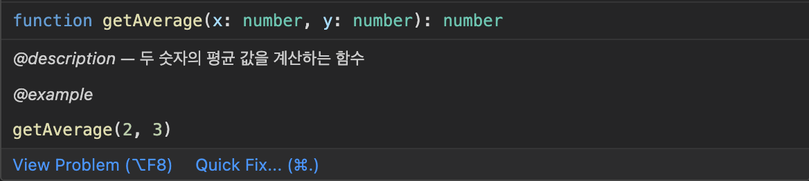
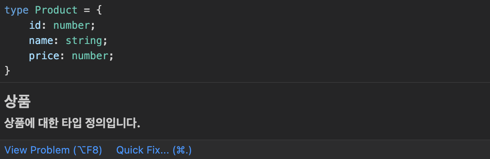
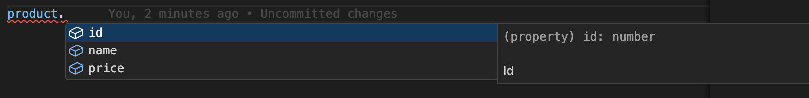
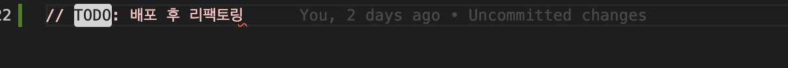
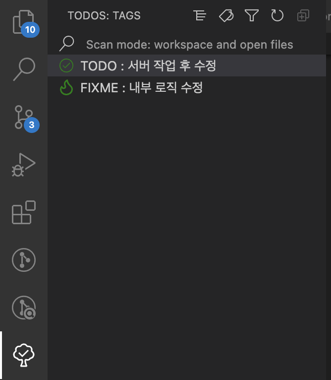

## 들어가기 앞서

개발을 시작한지 얼마 되지 않았을 때는 “주석이 필요 없는 코드가 좋은 코드”라는 생각에 주석을 작성하는 것에 대해서 부정적인 입장을 가지고 있었습니다.

하지만 실무에서 일을 할 수록 “잘” 작성된 주석은 팀 전체의 생산성을 높일 수 있다는 것을 몸소 깨닫게 되었는데요, 예를들어 복잡한 내부 로직을 가지고 있는 함수의 경우 내부 로직을 보지 않고도 주석만으로도 간단하게 파악할 수 있기 때문입니다.

이 때 조심할 점은 일관성 없이 작성된 주석의 경우 없는 것 만 못하다는 것입니다. 팀원 각자가 주석을 작성하는 방식이 다르다면 이는 오히려 코드를 읽는 사람으로 하여금 혼동을 줄 수 있습니다.

그렇기 때문에 주석을 “잘” 작성할 수 있는 방법은 우선 주석 작성에 대한 규칙을 정하고 이를 지키는 것이라고 생각합니다.

개인적으로 주석을 작성하는데 도움을 얻었던 도구와 어떠한 상황에서 주석을 작성했는지에 대해 공유하고자 합니다.

<br/>

## TSDoc

주석을 작성하기 위해 가장 중요한 것은 주석 작성에 대한 규칙을 정하는 것이라고 언급했는데요, 주석 작성의 기본적인 규칙은 TSDoc을 사용했습니다.

TSDoc이란 TypeScript 코드를 문서화하기 위한 표준으로, JavaScript 코드를 문서화하기 위한 JSDoc을 기반으로 합니다.

TSDoc은 주석 작성에 활용할 수 있는 태그(Tag)를 제공하는데 이를 통해서 함수, 클래스, 매개변수 등의 사용 방법과 목적을 설명할 수 있습니다.

그리고 JSDoc을 기반으로 하기 때문에 JSDoc에서 제공하는 기능들 또한 사용할 수 있습니다.

아래는 두 숫자를 받아서 평균 값을 반환하는 코드로, TSDoc에서 제공하는 `@description`와 `@example` 이라는 태그로 주석이 작성되어 있습니다.

주석을 통해 어떠한 역할을 하는 함수인지, 그리고 함수의 사용방법을 내부 로직을 보지 않고도 파악할 수 있습니다.

```tsx
/**
 *
 * @description 두 숫자의 평균 값을 계산하는 함수
 * @example getAverage(2, 3)
 *
 */
function getAverage(x: number, y: number): number {
  return (x + y) / 2
}
```

함수를 사용하는 곳에서도 함수가 작성된 파일에 이동해서 직접 주석을 확인할 필요 없이 함수 위에 마우스를 hover만 해도 작성된 주석을 확인할 수 있습니다.



반복적으로 사용되는 로직은 불필요한 코드 중복을 막기 위해 공통의 유틸 함수로 정의하는 경우가 많습니다. 만약 내부 로직이 복잡하거나 작동 원리를 한눈에 파악하기 어려운 경우에는 이렇게 주석을 통해 사용하는 방법을 함께 작성해준다면 사용하는 입장에서는 해당하는 유틸 함수의 역할을 쉽게 파악할 수 있다는 장점이 있습니다.

이외에도 TSDoc에서는 다양한 태그들을 제공하고 있는데, [공식문서](https://tsdoc.org/)에서 더 많은 태그를 확인할 수 있습니다.

TSDoc은 마크다운 문법과도 함께 작성될 수도 있습니다. 아래는 상품에 대한 타입인 Product에 대해 마크다운 문법과 함께 작성한 코드입니다.

```tsx
/**
 * ## 상품
 * ### 상품에 대한 타입 정의입니다.
 */
export type Product = {
  /** Id */
  id: number
  /** 이름 */
  name: string
  /** 가격 */
  price: number
}
```

이렇게 주석을 작성해주면 Product 타입을 사용하는 곳에서 마우스를 hover 해도 마크다운으로 작성된 정보를 확인할 수 있습니다.



그리고 Product 타입 내부를 보면 각 속성위에 주석이 작성되어 있는데요, 이렇게 주석을 작성하면 해당 타입을 사용하는 곳에서 속성에 접근할 때 주석으로 작성된 내용을 확인할 수 있습니다.



개인적으로는 API Response에 대한 타입을 정의할 때 주석을 적극적으로 사용하는 편인데요, 특히 변수명만 보고는 어떤 response인지 유추하기 힘든 경우에 이런식으로 마크다운과 주석을 함께 사용하면 해당 변수가 대한 정보를 쉽게 알아볼 수 있습니다.

<br/>

## TODO Tree

주석을 잘 작성하는데 유용한 또 다른 도구는 Todo Tree라는 VSCode Extension 입니다.

Todo Tree는 TODO, FIXME와 같은 태그들을 사용해서 주석으로 달 때 유용하게 사용할 수 있습니다.

Todo Tree 사용하기 위해 우선 VSCode에서 익스텐션을 설치한 다음, setting.json 파일 내부에 아래처럼 사용할 태그를 등록해줍니다

```tsx
"todo-tree.general.tags": ["TODO", "FIXME"]
```

이렇게 태그를 등록한 다음, 등록된 태그를 사용해서 주석을 작성하면 태그의 배경색이 강조된 것을 확인할 수 있습니다.



왼쪽 사이드바에 있는 Todo Tree 익스텐션 아이콘을 클릭하면 작성된 주석들을 태그별로 확인할 수 있습니다. 그리고 특정 태그만 필터링해서 확인할 수도 있습니다.



추가적으로 태그를 한 눈데 더 쉽게 파악할 수 있게 background 색상이나 아이콘을 추가할 수 있는데요, 아래와 같이 옵션을 추가하면 이전에 작성된 TODO 트리의 글자 배경색이 변경되고 아이콘이 추가된 것을 확인할 수 있습니다.

```tsx
"todo-tree.general.tags": ["TODO", "FIXME", "NAME", "NOTE"],
  "todo-tree.highlights.customHighlight": {
    "TODO": {
      "background": "#54BC52",
      "foreground": "#ffffff",
      "gutterIcon": true,
      "icon": "pin",
      "iconColour": "#54BC52"
    },
}
```


<br/>

## 결론

개인적으로는 TSDoc과 Todo Tree 같은 도구를 통해 주석을 작성하게 되면서 많은 도움을 얻을 수 있었습니다. 특히 복잡한 변수를 작성할 때 또는 다른 팀원이 작성한 유틸 함수나 유틸 타입을 사용할 때 주석과 함께 작성된 코드의 경우에는 사용하는 방법을 더 쉽게 파악할 수 있었습니다.

주석을 통해 생산성을 올릴 수 있지만 주석에 의존할 수 밖에 없는 코드를 작성하는 것은 굉장히 나쁜 습관이기 때문에 내가 작성한 코드가 주석이 없다면 알아볼 수 없는지에 대해 항상 경계를 하면서 코드를 작성하면 좋을 것 같습니다.
