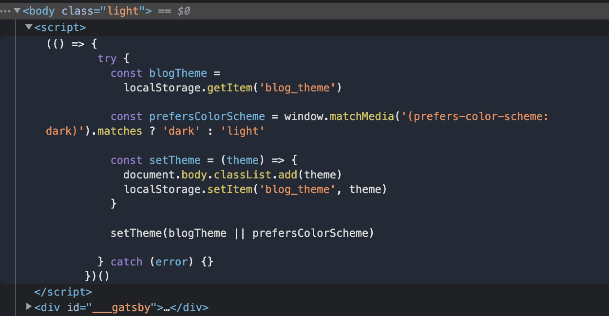

## 구현사항

블로그에 다크모드를 구현할 때 고려한 사항은 아래와 같습니다

1. 사용자가 테마를 바꿀 수 있는 기능
2. 다시 블로그에 접속했을 때 사용자가 이전에 선택한 테마 적용하기
3. 기본 시스템 테마 적용하기

---

### 1. 사용자가 테마를 바꿀 수 있는 기능 구현하기

사용자가 라이트모드와 다크모드 선택할 때, 선택한 모드에 따라 class를 추가해줄 것이기 때문에 우선 아래처럼 css파일에 다크모드와 라이트 모드를 위한 class 를 선언해줍니다.

```css
/* styles/global.css */

html,
body,
#___gatsby {
  height: 100%;
}

body {
  transition: background-color 0.3s linear;
}

body.light {
  background-color: #fff;
}

body.dark {
  background-color: #202122;
}
```

이렇게 선언한 파일을 `gatsby-browser.js`에 import 해줍니다. <br/>
`gatsby-browser.js` 은 browser 내의 gatsby 관련해서 일어나는 이벤트를 담당하는 파일로, `gatsby-browser.js` 에 필요한 css파일을 import 해주면 전역적으로 필요한 스티일을 적용해줄 수 있습니다.

```js
// gatsby-browser.js

import './src/styles/global.css'
```

그리고 나서 Custom hook을 정의해줍니다. Custom hook에는 테마가 변경될 때 마다 해당하는 테마에 맞는 class이름을 추가해주고, 이전에 있던 class 이름을 제거해주는 방식으로 테마를 변경시켜주는 toggleTheme함수를 정의해줍니다.

```js
// hooks/useTheme.tsx
import { useState } from 'react'

const useTheme = () => {
  const [theme, setTheme] = useState<string | null>(null)

  // 테마를 변경해주는 함수
  const toggleTheme = (theme: string | null) => {
    switch (theme) {
      case 'dark':
        document.body.classList.add('dark')
        document.body.classList.remove('light')
        setTheme('dark')
        break

      case 'light':
        document.body.classList.add('light')
        document.body.classList.remove('dark')
        setTheme('light')
        break

      default:
        break
    }
  }

  return { theme, toggleTheme }
}

export default useTheme
```

이렇게 정의한 Custom hook을 테마를 바꾸는 곳에 불러와서 사용합니다. 아래 코드처럼 테마를 바꾸는 버튼을 클릭하면 테마가 변경되고 선택한 테마에 맞는 버튼이 화면에 나타납니다.

```js
// pages/index.tsx
import React from 'react'
import useTheme from '../hooks/useTheme'

const IndexPage = () => {
  const { theme, toggleTheme } = useTheme()

  return (
    <div>
      {theme === 'dark' ? (
        <button onClick={() => toggleTheme('light')}>Current : DarkMode</button>
      ) : (
        <button onClick={() => toggleTheme('dark')}>Current : LightMode</button>
      )}
    </div>
  )
}

export default IndexPage
```

---

### 2. 다시 블로그에 접속했을 때 사용자가 선택한 테마 적용하기

하지만 이렇게만 구현하게 되면, 다시 페이지를 접속하거나 새로고침을 하는 경우 이전에 적용된 테마가 없어지게 됩니다. 따라서 local storage를 사용해서 선택한 테마를 저장해줍니다.

아래처럼 테마를 변경할 때 마다 `localStorage.setItem`을 사용해서 Local Storage에 변경된 테마를 저장해줍니다. 그리고 useEffect hook에 `localStorage.getItem`을 사용해서 블로그를 접속했을 때 저장된 테마가 있다면 해당하는 테마를 적용시켜 줍니다.

```js
import { useEffect, useState } from 'react'

const useTheme = () => {
  const [theme, setTheme] = useState<string | null>(null)

  const toggleTheme = (theme: string | null) => {
    switch (theme) {
      case 'dark':
        localStorage.setItem('blog_theme', 'dark') // local storage에 선택한 테마 저장
        document.body.classList.add('dark')
        document.body.classList.remove('light')
        setTheme('dark')
        break

      case 'light':
        localStorage.setItem('blog_theme', 'light')

        document.body.classList.add('light')
        document.body.classList.remove('dark')
        setTheme('light')
        break

      default:
        break
    }
  }

  useEffect(() => {
    if (typeof window !== 'undefined') {
      const currentTheme = localStorage.getItem('blog_theme') // 저장된 테마 있으면 적용

      toggleTheme(currentTheme)
    }
  }, [])

  return { theme, toggleTheme }
}

export default useTheme
```

---

### 3. 기본 시스템 테마 적용하기

이렇게 구현을 해주고 나면 다시 블로그에 접속했을 때 변경된 테마가 적용됩니다. <br/>
하지만 제일 처음 블로그에 접속했을 때 기본 시스템 테마가 적용되어 있지 않습니다. 이 때 사용할 수 있는 것이 `prefers-color-scheme` 미디어 쿼리입니다.

아래와 같이 기본 시스템 테마를 확인하고 해당하는 테마가 적용되도록 useEffect hook 코드를 수정해줍니다.

```js
// hooks/useTheme.tsx
...

  useEffect(() => {
    if (typeof window !== 'undefined') {

      // 기본 시스템 테마 확인
      const prefersColorScheme = window.matchMedia(
        '(prefers-color-scheme: dark)',
      ).matches
        ? 'dark'
        : 'light'

      const currentTheme = localStorage.getItem('blog_theme')

      // 이전에 선택한 테마 없으면 기본 시스템 테마 적용시켜 준다
      toggleTheme(currentTheme || prefersColorScheme)

    }
  }, [])

...

```

---

### 화면이 깜빡이는 문제 해결하기

지금까지 작성한 코드를 통해, 블로그에 접속했을 때 기본 시스템 테마를 적용시킬 수 있고 블로그에 다시 접속했을 때도 사용자가 적용한 테마가 적용됩니다. <br/>
하지만 다크모드를 설정한 후에 다시 블로그에 접속하거나 기본 시스템 테마가 다크모드인 경우 블로그에 접속해보면 화면이 깜빡이는 문제가 일어납니다.

이러한 문제가 발생하는 이유는 useTheme 파일의 useEffect hook 안에 테마를 적용하는 코드가 작성되어 있기 때문입니다. 즉, 처음 블로그에 접속했을 때는 테마가 없지만 useEffect hook이 실행되면서 다크모드가 적용되기 때문에 화면이 깜빡이는 현상이 일어나게 되는 것입니다.

이러한 문제를 해결할 수 있는 방법은 `gatsby-ssr.js`을 사용하는 것입니다. <br/>
`gatsby-ssr.js`을 사용해서 SSR(Server-Side Rendered)되는 정적 HTML 파일의 내용을 변경할 수 있습니다.

아래처럼 setPreBodyComponents함수를 사용해서 전달되는 컴포넌트 body 태그 가장 상단에 script 태그가 추가될 수 있도록합니다.<br/>
그리고 dangerouslySetInnerHTML를 사용해서 코드를 HTML document에 삽입해줍니다.

이 때 local storage에 테마가 있으면 해당하는 테마를 적용시키고, 따로 테마가 없는 경우에는 시스템 테마가 적용될 수 있도록 합니다.

```js
// gatsby-ssr.js`

export const onRenderBody = ({ setPreBodyComponents }) =>
  setPreBodyComponents([
    <script
      key="theme"
      dangerouslySetInnerHTML={{
        __html: `(() => {
        try {
          const blogTheme =
            localStorage.getItem('blog_theme')

          const prefersColorScheme = window.matchMedia('(prefers-color-scheme: dark)').matches ? 'dark' : 'light'

          const setTheme = (theme) => {
            document.body.classList.add(theme)
            localStorage.setItem('blog_theme', theme)
          }

          setTheme(blogTheme || prefersColorScheme)

        } catch (error) {}
      })()`,
      }}
    />,
  ])
```

코드를 수정해보면 body태그 가장 상단에 아래처럼 코드가 추가되어있는 것을 확인할 수 있습니다.



`gatsby-ssr.js`이 실행되면서 document.body에 클래스가 추가되기 때문에 useTheme hook도 아래처럼 document.body에 있는 class가 state 값이 되도록 수정해줍니다.

```tsx
// hooks/useTheme.tsx

...

useEffect(() => {
  if (typeof window !== "undefined") {
    setTheme(document.body.classList.value)
  }
}, [])

...

```

---

### 댓글에 다크모드 적용하기

이 블로그는 댓글 기능을 구현하기 위해 Utterance을 사용하고 있습니다. 따라서 테마가 변경되었을 때 Utterance에도 선택한 테마가 적용되어야 하는데, 이 때 Context API를 사용해서 댓글에도 테마가 적용되도록 할 수 있습니다.

theme를 변경시킬 수 있는 context와 theme 값을 받아올 수 있는 context를 만든다음 context를 반환해줍니다.

```js
// hooks/useTheme.tsx
import { useEffect, useState, createContext } from 'react'

export type ThemeActionType = (theme: string) => void

export const ThemeValueContext = createContext<string | null>(null) // theme 값 전달하는 context
export const ThemeToggleContext = createContext<ThemeActionType | null>(null) // theme 변경할 수 있는 함수 전달하는 context

const useTheme = () => {
  const [theme, setTheme] = useState<string | null>(null)

  const toggleTheme = (theme: string | null) => {
    switch (theme) {
      case 'dark':
        localStorage.setItem('blog_theme', 'dark')
        document.body.classList.add('dark')
        document.body.classList.remove('light')
        setTheme('dark')
        break

      case 'light':
        localStorage.setItem('blog_theme', 'light')

        document.body.classList.add('light')
        document.body.classList.remove('dark')
        setTheme('light')
        break

      default:
        break
    }
  }

  useEffect(() => {
    if (typeof window !== 'undefined') {
      setTheme(document.body.classList.value)
    }
  }, [])

  return { ThemeValueContext, ThemeToggleContext, theme, toggleTheme }
}

export default useTheme
```

그리고 테마를 변경하는 버튼이 있는 곳에서 Provider의 value로 theme 값과 theme를 변경시킬 수 있는 함수를 전달해줍니다

```js
// pages/index.tsx
import React from 'react'
import useTheme from '../hooks/useTheme'

const IndexPage = () => {
  const { theme, toggleTheme } = useTheme()

  return (
    <ThemeValueContext.Provider value={theme}>
      <ThemeToggleContext.Provider value={toggleTheme}>
        <div>
          {theme === 'dark' ? (
            <button onClick={() => toggleTheme('light')}>
              Current : DarkMode
            </button>
          ) : (
            <button onClick={() => toggleTheme('dark')}>
              Current : LightMode
            </button>
          )}
        </div>
      </ThemeToggleContext.Provider>
    </ThemeValueContext.Provider>
  )
}

export default IndexPage
```

댓글이 구현된 컴포넌트에서 useContext을 사용해서 필요한 테마를 가져온 다음, useEffect를 사용해서 theme 값이 변경될 때마다 해당하는 테마가 댓글에도 적용될 수 있도록 처리해줍니다. 댓클이 구현된 코드의 컴포넌트는 아래와 같습니다

```js
// components/Utterance.tsx

...

const Utterance = () => {
  const element: MutableRefObject<HTMLDivElement | null> =
    useRef<HTMLDivElement | null>(null)

  const theme = useContext(ThemeValueContext) // useContext을 사용해서 현재 theme 값을 가져온다

  // Utterance 만드는 함수
  const createUtterance = () => {
    const utterances: HTMLScriptElement = document.createElement("script")
    const attributes: UtterancesAttributesType = {
      src,
      repo,
      "issue-term": "title",
      label: "Comment",
      theme: `${theme === DARK_THEME ? "github-dark" : "github-light"}`,
      crossorigin: "anonymous",
      async: "true",
    }

    Object.entries(attributes).forEach(([key, value]) => {
      utterances.setAttribute(key, value)
    })

    element?.current?.appendChild(utterances)
  }

  // Utterance가 변경될 때 마다 실행되는 함수
  // 변경된 테마가 적용된다
  const changeUtterance = () => {
    const message = {
      type: "set-theme",
      theme: theme === DARK_THEME ? "github-dark" : "github-light",
    }
    const iframe = document.querySelector<HTMLIFrameElement>(UTTERANCE_CLASS)

    iframe?.contentWindow?.postMessage(message, src)
  }

  // 테마가 변경될 때 마다 변경된 테마가 적용된다
  useEffect(() => {
    if (!theme) return

    element.current?.querySelector(UTTERANCE_CLASS)
      ? changeUtterance()
      : createUtterance()
  }, [theme])

  return <div ref={element}></div>
}

export default Utterance
```

테마를 바꿀 수 있는 버튼을 클릭하면, Utterance 테마도 함께 변경되는 것을 확인할 수 있습니다.
